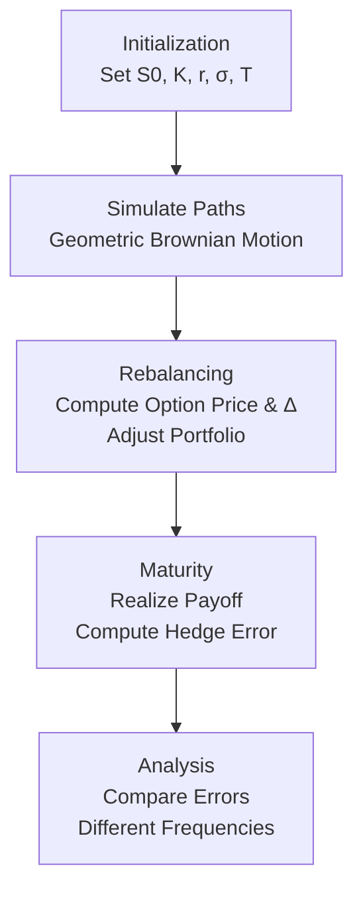

# Greeks-Hedging-Simulator

A Rust project that demonstrates **Delta hedging** in the Black-Scholes framework.  
It combines financial mathematics with high-performance simulation in Rust.

---

## Motivation
Options are risky because their value strongly depends on the underlying asset.  
The **Greeks** measure this sensitivity. With **Delta hedging**, you construct a portfolio (option + stock + bank account) that is locally immune to small price movements.

Delta hedging is dynamic: since Delta changes with time and stock price, the hedge must be rebalanced regularly. This simulator shows how the hedge error decreases with more frequent rebalancing.

---

## Model

- **Underlying process (Geometric Brownian Motion):**

  ```math
  S_{t+\Delta t} = S_t \cdot \exp\!\Big((r - \tfrac{1}{2}\sigma^2)\Delta t + \sigma \sqrt{\Delta t} \cdot Z\Big), \quad Z \sim \mathcal{N}(0,1)
  ```

- **Option (European Call):**

  The closed-form Black-Scholes price is used as benchmark:

  ```math
  C(S,t) = S \cdot N(d_1) - K e^{-rT} N(d_2)
  ```

- **Delta:**

  ```math
  \Delta = N(d_1)
  ```

- **Portfolio:**

  ```math
  \Pi = C - \Delta \cdot S + \text{BankAccount}
  ```

---

## Simulation Steps

1. **Initialization**  
   Set parameters: spot price, strike, interest rate, volatility, time to maturity.

2. **Path simulation**  
   Generate stock paths using the Geometric Brownian Motion model.

3. **Rebalancing**  
   At each time step:  
   - Compute option price and Delta with the Black-Scholes formula.  
   - Adjust portfolio holdings accordingly.  

4. **Maturity**  
   Option payoff is realized. The difference between portfolio value and theoretical fair value is the hedge error.

---

## Features
- Simulation of Delta-hedged option portfolios  
- Comparison of different rebalancing frequencies  
- Parallel path simulation with [`rayon`](https://crates.io/crates/rayon)  
- Optional: load pre-generated random numbers with [`memmap2`](https://crates.io/crates/memmap2)  
- Analysis of hedge error versus rebalancing strategy  

---

## Expected Results
- Infrequent rebalancing → larger hedge error  
- Frequent rebalancing → hedge error close to zero (in the idealized model without transaction costs)  
- Large number of simulated paths → more accurate statistical results  

---

## Project Structure

src/
├─ black_scholes.rs # Black-Scholes pricing and Greeks
├─ simulate.rs # Stock price simulation (GBM)
├─ hedge.rs # Portfolio and hedging logic
└─ main.rs # CLI and runner


---

## Example Usage
```bash
cargo run --release -- \
    --s0 100 \
    --k 100 \
    --r 0.05 \
    --sigma 0.2 \
    --t 1.0 \
    --paths 10000 \
    --steps 252
  ```
---

## Visualisation


